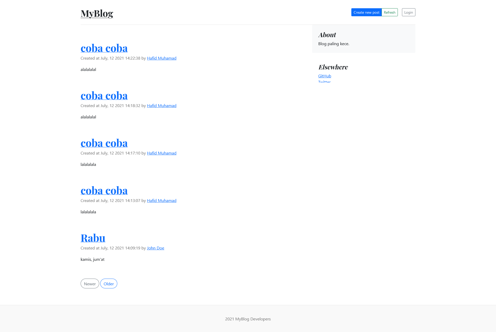

# Proyek Laravel MyBlog

## Purpose

Diajukan untuk memenuhi Ujian Akhir Semester API di STMIK "AMIKBANDUNG"

## Tech

- Alpine.js
- Axios
- Laravel Mix
- Tailwindcss

## Cara akses

1. Clone repository
2. Gunakan `composer update` dan `npm install` untuk memasang package yang digunakan dalam proyek
3. Jalankan command `copy .env.example .env` untuk menyalin `.env`
4. Lakukan command `php artisan key:generate` untuk melakukan generate `APP_KEY` di `.env`
5. Buat database kosong di MySQL dengan nama `laravel`
6. Pastikan konfigurasi `.env` sudah menggunakan nama database laravel dengan DB MySQL
7. Jalankan command `php artisan migrate` untuk melakukan generate struktur tabel dari migration
8. Jangan lupa untuk juga jalankan `php artisan db:seed`, command ini digunakan untuk memenuhi isi tabel yang tadi sudah di-*generate*
9. Terakhir untuk menjalankan aplikasi silakan gunakan `php artisan serve`, buka peramban dan akses tautan `localhost:8000`
